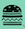

# React Hamburger Menu

Standard hamburger menu in React.js.
[Try it here](https://rococo-creponne-b55eb4.netlify.app/)

## References

- [React Icons](https://react-icons.github.io/react-icons/)

## How'd you do that?

1. First I createed a new React app.

```bash
npx create-react-app hamburger-menu
```

2. After deleting the boiler-plate React files that I don't need, I created a `HamburgerMenu.jsx` file.

3. I made a regular blank JSX function in the new file.

```javascript
function HamburgerMenu() {}
export default HamburgerMenu;
```

4. We're going to need to import a few things here. Most importantly lets bring in our useState like so:

```javascript
import { useState } from "react";
```

5. Icons! You're gonna need a menu and an exit icon. You can use whatever icons you like, but I used this cute hamburger logo  in lieu of the traditional 3 lined one . I used [React Icons](https://react-icons.github.io/react-icons/)

```bash
npm install react-icons --save
```

Import those icons on the top of your page with your useState

```javascript
import { NavLink } from "react-router-dom";
import { GrClose } from "react-icons/gr";
```

6. Mmmk, we are getting there. Now, lets add our destructed array for our useState. Set him to false. Your JSX function should look like this thang so far.

```javascript
import { useState } from "react";
import { GiHamburger } from "react-icons/gi";
import { NavLink } from "react-router-dom";
import { GrClose } from "react-icons/gr";

function HamburgerMenu() {
  const [navbarOpen, setNavbarOpen] = useState(false);
}
export default HamburgerMenu;
```

7. Lets set up our return within our HamburgerMenu function.

```javascript
return (
  <nav className="nav-bar">
    <button>
      <GrClose /> //icon
      <GiHamburger /> //icon
    </button>
    <ul>
      <li>Burger One</li>
      <li>Burger Two</li>
      <li>Burger Three</li>
    </ul>
  </nav>
);
```

....instructions are still in progress! I gotta go be a human being so I'll finish later. Come back soon.
